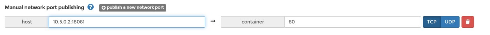

# Get Started With Portainer

## TL;DR


Nowadays everybody speaking and writing about containers, Docker, Kubernetes, OpenShift, etc. I don't want to explain here what are these meaning, instead give some practical use cases. Most of my examples are suitable for home users. I'm always testing my solutions at home with low cost HWs.  
I have an article about installing single node Kubernetes cluster, but now I step back to Docker containers. This is because deploying a container orchestrator not always a the goal. This article could be useful for home users, or developers who want learn about containers. 

## Use Containers Instead Of Virtual Machines

What is wrong with installing software to your Laptop or Desktop? Sooner or later you will end up in having a lot of unnecessary software on your machine. Or you have to install various software with various dependencies which could not be resolved. There are so many possibilities to separate a test environment from your host machine:

* [WirtualBox](https://www.virtualbox.org)
* [LXC](https://linuxcontainers.org)
* [KVM](https://www.linux-kvm.org)
* [Proxmox](https://www.proxmox.com/en/)
* [PythonVirtualEnv](https://docs.python.org/3/tutorial/venv.html)

All of them has the advantages and disadvantages. Proxmox is really good if you have a separate hardware to install. It can handle LXC Containers and HW virtualization as well. VirtualBox is an easy-to-use Virtualisation platform. It can be installed on Linux, Windows and even on MAC.  
But all of these have bigger footprint on you host hardware than Docker.

Let's see how easy to try a software with Docker, for example Ghost blog:

Link: [https://hub.docker.com/_/ghost](https://hub.docker.com/_/ghost)


```bash
docker run -d --name some-ghost \
-p 3001:2368 \
-v /path/to/ghost/blog:/var/lib/ghost/content \
ghost:alpine
```


In some seconds you can access Ghost on `http://localhost:3001`. I can't imagine easier or faster way to try out something.

!!! note
  The situation is more complicated, of coures, if you want to use external database, redis, etc in conjungtion with Ghost. But if you only want to test/try out Ghost it is the fastest way I think.

In most cases you can find a really goot documentation about how to use a software with Docker. --> A lot of application have Dockerized version, but you can create own image, as well.

Docker can be useful even in a situation where you don't have root access to the system, but Docker engine is installed and you can access to it. 

## Install Portainer

What is Portainer?

!!! quote
    Portainer is a really nice web UI for Docker. Portainer is a lightweight management UI which allows you to easily manage your different Docker environments (Docker hosts or Swarm clusters). Portainer is meant to be as simple to deploy as it is to use.

Official Install Documentation: [https://docs.portainer.io/v/ce-2.9/start/install/server/docker/linux](https://docs.portainer.io/v/ce-2.9/start/install/server/docker/linux)

The doc says: "First, create the volume that Portainer Server will use to store its database"  
But I won't do that. I don't like using Docker volumes. By default the volumes are stored in `/var/lib/docker/volumes` directory, and extra stepes are needed to find which volume belongs to which container. So I usually use [Bind Mounts](https://docs.docker.com/storage/bind-mounts/). 

**Start Portainer:**

```bash
docker run -d \
-p 8000:8000 -p 9443:9443 \
--name portainer \
--restart=always \
-v /var/run/docker.sock:/var/run/docker.sock \
-v /opt/docker/portainer/data:/data \
portainer/portainer-ce:2.9.1-alpine
```

The official documentation says to use the `latest` (`portainer/portainer-ce:latest`) image, but:

Read about `latest` tag: [https://vsupalov.com/docker-latest-tag/](https://vsupalov.com/docker-latest-tag/)

What is my biggest problem with the `latest` tag? The updates! For example: an application is installed to the Kubernetes cluster, with database dependency. A new version of the app come out and the `latest` tag will points to this newer version. Next time when the pod restarts (for some reason) the newer version will be deployed. If the new version has breaking changes (eg.: database scheme changes, or manual config needs), your app won't start (properly).  
Or simply you don't want always use the latest version...

!!! info
    The situation above partially can be avoided with properly configured imagePullPolicy: [https://kubernetes.io/docs/concepts/containers/images/#image-pull-policy](https://kubernetes.io/docs/concepts/containers/images/#image-pull-policy)

    Just partially because if the pod restarts in a node that don't have the image, alway  the `latest` image will be pulled...

So I recommend not to use the `latest` tag.

### Portainer On VPS (Public Internet)

It is not an elegant to publish your Portainer to the public Internet. Of Course this not an issue when you install portainer inside a private network. But if you planning to use portainer on a VPS which has public IP address it is recommended not to bind the public IP address, or set up a firewall (iptables).

I think the best solution is setting up a VPN connection between the server and your PC. I can recommend two almost zero config VPN solutions:

* [https://tailscale.com](https://tailscale.com)
* [https://www.wireguard.com](https://www.wireguard.com)
* Or you can use OpenVPN/IpSecVPN, if you familiar with them.

So if you want to bind Portainer on a specific IP address use the following command:

```bash
docker run -d \
-p 10.5.0.2:8000:8000 -p 10.5.0.2:9443:9443 \
--name portainer \
--restart=always \
-v /var/run/docker.sock:/var/run/docker.sock \
-v /opt/docker/portainer/data:/data \
portainer/portainer-ce:2.9.1-alpine
```

Where the `10.5.0.2`  is the IP Address of your VPN interface (tun0,wg0,tailscale0, etc).

How does it look like:

<pre class="command-line" data-user="root" data-host="dockerhost" data-output="2-3"><code class="language-bash">docker ps --filter name=portainer
CONTAINER ID   IMAGE                           COMMAND        CREATED        STATUS        PORTS                                                          NAMES
90ca6ef446e3   portainer/portainer-ce:latest   "/portainer"   43 hours ago   Up 43 hours   10.5.0.2:8000->8000/tcp, 10.5.0.2:9443->9443/tcp, 9000/tcp   portainer</code></pre>


Now you can access Portainer on [https://10.5.0.2:9443](https://10.5.0.2:9443)

We are now done with the installation.

## Using Portainer

### First Steps

**Create an admin user**


**Select "GetStarted"**


**Click on the "local" machine**


### Create New Docker Network

By default there are three networks:


What you see is equialent to `docker network ls` command:

<pre class="command-line" data-user="root" data-host="dockerhost" data-output="2-5"><code class="language-bash">docker network ls
NETWORK ID     NAME      DRIVER    SCOPE
e15c0c8f8d67   bridge    bridge    local
f728316f0193   host      host      local
54ac360308df   none      null      local</code></pre>


If you need more details about a network use the `inspect` command:

<pre class="command-line" data-user="root" data-host="dockerhost" data-output="2-46"><code class="language-bash">docker inspect  e15c0c8f8d67
[
    {
        "Name": "bridge",
        "Id": "e15c0c8f8d67adc6b03876861c15c97bf581a97c75b9bedef7d48ecf6c906b0a",
        "Created": "2021-10-01T11:25:52.320103343+02:00",
        "Scope": "local",
        "Driver": "bridge",
        "EnableIPv6": false,
        "IPAM": {
            "Driver": "default",
            "Options": null,
            "Config": [
                {
                    "Subnet": "172.18.0.0/16",
                    "Gateway": "172.18.0.1"
                }
            ]
        },
        "Internal": false,
        "Attachable": false,
        "Ingress": false,
        "ConfigFrom": {
            "Network": ""
        },
        "ConfigOnly": false,
        "Containers": {
            "6c543ab5794bd752c29709a622f561a5d6647a071e802729ab8386759d3bcae6": {
                "Name": "portainer",
                "EndpointID": "b22b41e7e501de25a5b25d4320297224b5a87deb7c898c56ed0376af02c54917",
                "MacAddress": "02:42:ac:12:00:02",
                "IPv4Address": "172.18.0.2/16",
                "IPv6Address": ""
            }
        },
        "Options": {
            "com.docker.network.bridge.default_bridge": "true",
            "com.docker.network.bridge.enable_icc": "true",
            "com.docker.network.bridge.enable_ip_masquerade": "true",
            "com.docker.network.bridge.host_binding_ipv4": "0.0.0.0",
            "com.docker.network.bridge.name": "docker0",
            "com.docker.network.driver.mtu": "1500"
        },
        "Labels": {}
    }
]</code></pre>


**Why should we create new network?**

Link: [https://docs.docker.com/network/bridge/#differences-between-user-defined-bridges-and-the-default-bridge](https://docs.docker.com/network/bridge/#differences-between-user-defined-bridges-and-the-default-bridge)

I want to emphasize two adventages:

* User-defined bridges provide automatic DNS resolution between containers
* You can enable manual container attachment

!!! hint
    Inside a docker network it us absolutely not recommended to use static IP addresses for containers. It is antipatern. Use the container's name instead of the IP address when you have to connect containers to each other and put them into the same network.

Click on the "Add network" button.

* **Name:** Give a name to the new network. (custom_bridge)
* **Driver:** Bridge
* IPV4 Network configuration


!!! info
  **IP range:** Can differ from the Subnet. The containers will automatically get IP address from this range. (DHCP) Must be smaller than the entire Subnet.

* **Enable manual container attachment:** Turn On

This can achieve with cli command as well:

```bash
docker network create custom-cli \
--attachable \
--driver bridge \
--gateway 10.10.10.1 \
--ip-range 10.10.10.0/24 \
--subnet 10.10.10.0/24
```

You can decide which method (portainer or cli) is best for you.


### Deploy App (Container) From Template

This is the easies way in Portainer to deploy an application. Choose "App Templates" from the menu, and click on Docker "Registry":


And Fill Name and Network, then click on "Deploy the container":


Chheck the container:


You can click on it and see all the details. 

Try our new docker Registry:

<pre class="command-line" data-user="root" data-host="dockerhost" data-output="3-9"><code class="language-bash">docker tag registry:latest 127.0.0.1:49153/registry/registry:v1
docker push 127.0.0.1:49153/registry/registry:v1
The push refers to repository [127.0.0.1:49153/registry/registry]
6da1e15d5d7f: Pushed
d385a2515a0f: Pushed
d661c8a70d1e: Pushed
02ada6f7a843: Pushed
39982b2a789a: Pushed
v1: digest: sha256:b0b8dd398630cbb819d9a9c2fbd50561370856874b5d5d935be2e0af07c0ff4c size: 1363</code></pre>


We successfully pushed the locally stored portainer image to our new registry.
Unfortunately there is no easy way the list the images form the custom registry. If you need a gui please check this: [https://github.com/Joxit/docker-registry-ui](https://github.com/Joxit/docker-registry-ui)

At the moment we don't have any other choice than use the API:

<pre class="command-line" data-user="root" data-host="dockerhost" data-output="2-7,9-14"><code class="language-bash">curl -s http://127.0.0.1:49153/v2/_catalog | jq
{
  "repositories": [
    "registry/registry"
  ]
}

curl -s http://127.0.0.1:49153/v2/registry/registry/tags/list | jq
{
  "name": "registry/registry",
  "tags": [
    "v1"
  ]
}</code></pre>


### Deploy Single Container

We are going to deploy the registy ui, metioned in the previous chapter.

Docker HUB link: [https://hub.docker.com/r/joxit/docker-registry-ui](https://hub.docker.com/r/joxit/docker-registry-ui)

#### Name, Registry An Port Mapping


* **Name**: registriy-ui
* **Registry**: DockerHub
* **Image**: joxit/docker-registry-ui
* **Always pull the image**: OFF
* **Publish all exposed network ports to random host ports**: ON
* **Publish Port** 18081 --> 80

!!! important
    You have to pull the image first, if you use always pull image: **==off==**
    `docker pull joxit/docker-registry-ui` Or you can use the Portainer Image menu for pulling the image.

    Do not use "Publish all exposed network ports to random host ports"! Every time the container restart new host port will be assigned!


#### Network

Use the previusly defined network:


#### Environments

Check the official documentation on DockerHUB: [https://hub.docker.com/r/joxit/docker-registry-ui](https://hub.docker.com/r/joxit/docker-registry-ui)

```conf
REGISTRY_URL=http://localhost:18081
REGISTRY_TITLE=Test Registry @ localhost
SHOW_CONTENT_DIGEST=true
SINGLE_REGISTRY=true
NGINX_PROXY_PASS_URL=http://registry:5000
```

**Screenshot**


* **REGISTRY_URL**

Use the host on which you want to access your registry-ui. It should be the same as used in Docker port publishing (-p), or at portainer gui.
Another example:



In this case the REGISTRY_URL should be `http://10.5.0.2:18081`.

* **NGINX_PROXY_PASS_URL**

The most important is attaching both the registry and registry URL to the same network (custom_bridge)! In this way containers can acceess each other inside this network with there name.

For better understanding please see the following examples:

<pre class="command-line" data-user="root" data-host="dockerhost" data-output="2-6,9-13,16-22"><code class="language-bash">docker ps
CONTAINER ID   IMAGE                                 COMMAND                  CREATED          STATUS          PORTS                                                      NAMES
dcbf77aa6492   joxit/docker-registry-ui:latest       "/docker-entrypoint.…"   11 minutes ago   Up 11 minutes   0.0.0.0:18081->80/tcp                                      registriy-ui
031ffbed2392   registry:latest                       "/entrypoint.sh /etc…"   4 hours ago      Up 4 hours      0.0.0.0:49153->5000/tcp                                    registry
6c543ab5794b   portainer/portainer-ce:2.9.1-alpine   "/portainer"             5 hours ago      Up 5 hours      0.0.0.0:8000->8000/tcp, 0.0.0.0:9443->9443/tcp, 9000/tcp   portainer

docker exec -it registriy-ui /bin/sh
curl -i http://registry:5000
HTTP/1.1 200 OK
Cache-Control: no-cache
Date: Thu, 14 Oct 2021 16:43:45 GMT
Content-Length: 0

docker exec -it registry /bin/sh
ping registriy-ui
PING registriy-ui (10.1.1.3): 56 data bytes
64 bytes from 10.1.1.3: seq=0 ttl=64 time=0.068 ms
64 bytes from 10.1.1.3: seq=1 ttl=64 time=0.098 ms
^C
--- registriy-ui ping statistics ---
2 packets transmitted, 2 packets received, 0% packet loss
round-trip min/avg/max = 0.068/0.083/0.098 ms</code></pre>


Regarding the port, inside a Docker network always use the port on which the process itself is listening on, NOT the published port. (`0.0.0.0:49153->5000/tcp`)

If you get error like this:
```plain
An error occured: Check your connection and your registry must have `Access-Control-Allow-Origin` header set to `http://127.0.0.1:18081`
```

This is likely becase the `REGISTRY_URL` is miss-configured.

If everything went good, the Registry-UI web should look like this:


### Stack (compose)

What Is The Problem With Single containers?

Deploying singe containers is suitable only for a quick test. Main problems:

* If you accidentally delete the container you loose all it's configuration (port mapping, environments, volume and network settings).
* You can not easily reproduce the container on another host
* If you need to connect two or more container to each other you must manually assign them to the same network, and even the network has to be created manually.
* Containers won't be backed up when you create Portainer backup. 

The solution is [docker-compose](https://docs.docker.com/compose/compose-file/compose-file-v3/), or the the Portainer way = Stack. Create a Stack means writing a docker compose file (yaml).

All we have done before can be defined in a single file:

```yaml
version: "3"
services:
  registry:
    deploy:
      replicas: 1
    image: registry:latest
    container_name: registry
    restart: always
    volumes:
      - /var/lib/registry:/var/lib/registry
    environment:
      - TZ=Europe/Budapest
    ports:
      - 5000:5000
    networks:
      - registy
  registry-ui:
    deploy:
      replicas: 1
    image: joxit/docker-registry-ui:latest
    container_name: registry-ui
    ports:
      - 18081:80
    environment:
      - REGISTRY_URL=http://localhost:18081
      - REGISTRY_TITLE=Test Registry @ localhost
      - SHOW_CONTENT_DIGEST=true
      - SINGLE_REGISTRY=true
      - NGINX_PROXY_PASS_URL=http://registry:5000
    networks:
      - registy
networks:
  registy:
    driver: bridge
    ipam:
      driver: default
      config:
       - subnet: "10.101.0.1/29"
```


Copy and paste this yaml to your Portainer:


And Click "Deploy the stack" button.

This Stack will create a network:


And the Stack will look like this:


This `yaml` file can be used on any Portainer instance or without Portainer using the `docker-compose` cli tool.

Save the above `yaml` as `docker-compose.yaml` and start the containers:
```
docker-compose up -d
Creating network "registry_registy" with driver "bridge"
Creating registry-ui ... done
Creating registry    ... done
```

You can stop the Stack with `docker-compose down` command. 

!!! warning
    You have to be in th directory which contains `docker-compose.yaml` file when running  `docker-compose` command

??? tip
    Do not mix using docker-compose and Portainer Stack, unless you are brave enough. It won't cause any tehcnical problem, but very confusing, I think.

### Stack With Git

When you are working on something for hours or days it become really important to have a backup of your work. In this case also important that your work could be reproducable on any other system (portability). Stack are very good start points. But how to track the modifications? How to make backups? Where to store our yaml files?  
You can create backup from your portainer instance. [(Setting / Backup configuration)](https://docs.portainer.io/v/ce-2.9/admin/settings#backup-portainer) But unfortunately scheduled backup available only for business users. Workaround could be saving the portainer data directory (`/opt/docker/portainer/data`).  
Despite backup we still need track the modifications. 

Portainer has a great feature: We can use a git repository for creating stacks. I absolutely recommend everybody to use Git repository to sotre the Stack (comopse) files. 


