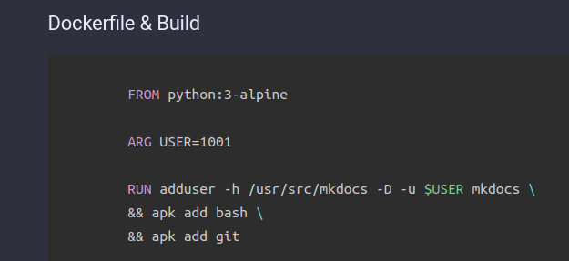

# How to use MKdocs?

## TL;DR

As wrote on the index page, I changed from Ghos Blog to MKDocs. This was necessary because my Ghost version was really outdated and I could not get used to its new editor.  
I have some essential requirement against the platform I use:

* Should be easy to use with native MarkDown support
* Should not have billions of features I won't use ever (to avoid unnecessary system load)
* Must have integrated very good search engine
* Look-And-Feel must be easily customised without plugins or addons
* Since I post a lot of code bloks, code highlighting is must. It should be achieved natively or using prism.js
* Source code of the contens (*.md) shold be stored in a Git repository.

### What was the alternatives?

* CMS Systems
  * Drupal, WordPress, Joomla : All of these are CMS systems, and too robust for my purpose. I needed a light-weight system.
* Static Site Generators and 
  * Jekyll, Gatsby.js, Scully, MKDocs, etc. : They are way more closer to my expectations. 

And how I chose up MKDocs over the rest? My selection process was really simple. I gave a try all of them, this means I spent 2 hours to try each of them. The winner was with which I could get closer to my expectations in 2 hours. And of course which was closer to my taste in coding, manageability and flexibility.

Now It seems MKDocs does exactly what I need. Probably most of the other static website gernerator would have been perfect for me, but after 2 hours of using I found it rellay comfortable for me. And I did not regret my choice. All of my old contents are migrated to this site, and meantime I did some customisation on the the theme and the site. And this is the main topic of this post: How I migrated the content and how I use MKDocs?

## Prepare MKDocs Docker Image

If you blinks at the official MKDocs installtion page you can see that the installation should be done by run `python pip install` command.  
I don't like to install various python packages on my computer, because sooner or later I'm going to stuck in failed requirements. So at the first step I had to make decision what to use: python virtualenv or Docker. Of course I chose Docker.

I do know that "Material for MkDocs" have official Docker image, but I like to use Docker images was built by my own. Every time I build a new Docker image from scratch I learn something or make my knowledge deeper about Dockerfiles, so it's absolutely worth it.

### Dockerfile & Build
<pre class="line-numbers language-docker" data-src="/files/Dockerfile"></pre>

* `FROM python:3-alpine` --> Using the official python image.
* `ARG USER=1001` --> Default user id. If you don't specify another when building the container (see below)
* `ENTRYPOINT` --> The default command to run when the container starts.


**Build command**
```bash
docker build -t exmaple-mkdocs:v1 --build-arg=USER=$(id -u) .
```

!!! important
    Docker container will be built using your local user id. This will help you to avoid permission deined when mounting local directory inside the container. 


### Usage Examples

* Get help
```bash
docker run -it exmaple-mkdocs:v1 --help
```

* Create New Site
```bash
mkdir /tmp/example/
docker run -it -v /tmp/example:/build exmaple-mkdocs:v1 new /build
```

This command will create the following initial files (inside the `/tmp/example` directory on you local system:
```plain
.
./docs
./docs/index.md
./mkdocs.yml
```

!!! info
    With  `-v` parameter you can mount one of your local directory inside the container (bind mount). So the running process iside the container will see your local direcotry `/tmp/example` as `bild`. (`-v /HOST-DIR:/CONTAINER-DIR`). If 'HOST-DIR' is omitted, Docker automatically creates the new volume on the host (default location: `/var/lib/docker/volumes`).


* Get into the container
```bash
docker run -it --entrypoint=/bin/bash exmaple-mkdocs:v1

```

* Run the builtin development server
```bash
docker run -it -p 8789:8000 \
-v /tmp/example:/build exmaple-mkdocs:v1 \
serve --dev-addr 0.0.0.0:8000 --config-file /build/mkdocs.yml
```

This command may need some explanation:

* `docker run -it` --> Run the container in interacrive mode and allocate a pseudo-tty.
* `-p 8789:8000` --> Publish container port **8000** on the host port **8789**. This means process binding the port 8000 inside the container will be published on the local port 8789.
* `serve --dev-addr 0.0.0.0:8000 --config-file /build/mkdocs.yml` --> Arguments of the `mkdocs` command. (ENTRYPOINT)
  - The bind port (8000) must be the same as specified at `-p` parameter.
  - Since we bind mounted the `/tmp/example` local directory into the container's `/build` we can acces mkdocs.yml inside the container as `/build/mkdocs.yml`


Now you can access your newly created site at http://localhost:8789 or http://[your machine ip address]:8789.  
Every modification inside the `/tmp/example` directory immediately take effetcs, so you don't need to restart the container, your browser will refresh the page automatically. But be aware that if you make systax error in the `mkdocs.yml` the container will exit and you need to manually retart it.

## Configure

### mkdocs.yml

Configuring your MKDocs intstance basically means editing `mkdocs.yml`.

You can see my current configuration below:
<pre class="line-numbers language-yaml" data-src="/files/mkdocs.yml"></pre>

I think there is nothing special in this configuration, but could be a good example. Every part of this file is very well documented on the officail Material and MKDocs website:

* [https://www.mkdocs.org/user-guide/](https://www.mkdocs.org/user-guide/)
* [https://squidfunk.github.io/mkdocs-material/](https://squidfunk.github.io/mkdocs-material/)

!!! info
    All the items in the `nav` section is relative to the `docs` directory. Example: `old/Iptables_Examples.md` is located at `/tmp/example/docs/old/Iptables_Examples.md`


I think the only thing to metion is my `extra.css` file.

### `extra.css`

```css
.md-grid {
max-width: initial;
}
 
pre[class*="language-"] {
       max-height: 32em !important; 
}

.md-clipboard {
  display: none !important;
}

.md-typeset pre>code {
   overflow: unset !important;
   padding: unset !important;
}
```

I know using `!important` is not the best things to do, but I'm not a web developer and I needed a 'quick and dirty solution'. Maybe later, if I have more time I will customise the mkdocs theme and leave `!important`.

??? info
    More about `!important`: [https://stackoverflow.com/questions/9245353/what-does-important-mean-in-css](https://stackoverflow.com/questions/9245353/what-does-important-mean-in-css). "Using !important has its purposes (though I struggle to think of them), but it's much like using a nuclear explosion to stop the foxes killing your chickens; yes, the foxes will be killed, but so will the chickens. And the neighbourhood."

* **md-grid (Material Theme)**

Reference: [Content area width](https://squidfunk.github.io/mkdocs-material/setup/setting-up-navigation/?h=width#content-area-width)

> The width of the content area is set so the length of each line doesn't exceed 80-100 characters, depending on the width of the characters. While this is a reasonable default, as longer lines tend to be harder to read, it may be desirable to increase the overall width of the content area, or even make it stretch to the entire available space.
> This can easily be achieved with an additional stylesheet and a few lines of CSS:  
> .md-grid {  
>  max-width: initial;  
>  }

* **pre[class*="language-"] (prismjs)**

Add vertical scroll bar when code block cointans more than 32 lines.

* **md-clipboard (Material Theme)**

This section disables the theme built in "copy to clipoad" funcion, it's neccessary if you wish to use the prismjs "copy to clipboard" method.

* **md-typeset pre>code (Material Theme)**

Some functions of prismj won't work properly without this modification, for example line numbering.

Example: 
```html
<pre class="line-numbers language-docker" data-src="/files/Dockerfile"></pre>
```
**Screenshot:**



You can see that the line number from the left hand side of the lines are missing.

## Build the site

If you are done writing your docs, and `nav` section is properly configured in `mkdocs.yml` it's time to build your site. I will show three methods to publis the site.

!!! important
    `mkdocs serve` is absolutely not suitable for production. It's only purpose to help you developing the site, and watch realtime your modification.

### Build Site & Own Web Server

If you already have a web servers you can simply copy your content to the DocmentRoot.  
You can simply build your site:

```bash
docker run -it \
-v /tmp/example:/build exmaple-mkdocs:v1 \
build
```

This command will put your static html site into the `/tmp/example/site` directory on your host machine.
Or you can sepcify where to store the generated content:

```bash
docker run -it \
-v /tmp/example:/build exmaple-mkdocs:v1 \
-v /var/www/html/mysite:/site \
build --site-dir /site
```

### Build Site & Nginx with Docer

This method almost the same as the previous one, except that here we are using another Docker container to server our page. First build your site with buld command. 

**Server your page with Nginx**

First start your container in the foreground to check if everything is fine:
```bash
docker run -it --rm \
--name mkdocs \
-v [PATH TO YOUR SITE DIR]:/usr/share/nginx/html:ro \
-p 8087:80 \
nginx:latest
```

If you can access your site on the host port 8087, you should stop the container (ctrl+c) and start again in detached mode:

```bash
docker run -d \
--restart alaway \
--name mkdocs \
-v [PATH TO YOUR SITE DIR]:/usr/share/nginx/html:ro \
-p 8087:80 \
nginx:latest
```

More abaout Nginx container image: [https://hub.docker.com/_/nginx](https://hub.docker.com/_/nginx)


### GitHub Pages

This is the method I use. I'm not borering with own web server instead I use github pages: [https://pages.github.com](https://pages.github.com)  
For this you need a free [Github](https://github.com) registration. 

* **1. Create a repository**


The name of the repository must be [your username]**.github.io** and must be public. In my case:


* **2. Push**

Github does not support user/pass uath anymore, so you need to create an auth token.

Go to **settings**: 


**Developer settings**:


And **Personal access tokens**:

Finally click on the **Generate new token**, select the permissions you need and generate the token.

**Push your mkdocs root dir:**

<pre class="command-line" data-user="root" data-host="mkdocs" data-output="2-12"><code class="language-bash">ls -al
total 40
drwxr-xr-x  7 root root 4096 Oct  9 14:34 .
drwx------ 22 root root 4096 Oct  9 14:33 ..
drwxr-xr-x  6 root root 4096 Oct  9 14:33 cinder
-rw-r--r--  1 root root  162 Oct  9 14:33 docker.cmd
drwxr-xr-x  8 root root 4096 Oct  9 14:33 docs
drwxr-xr-x  8 root root 4096 Oct  9 14:35 .git
-rw-r--r--  1 root root 4471 Oct  9 14:33 mkdocs.yml
drwxr-xr-x  2 root root 4096 Oct  9 14:33 overrides
drwxr-xr-x 11 root root 4096 Oct  9 14:33 site

git init
git add --all
git commit -m 'Initial release'
git remote add origin https://github.com/jvincze84/test-delete.git
git push -u origin master</code></pre>

* **3. Push gh-pages**

<pre class="command-line" data-user="root" data-host="mkdocs" data-output="3-24"><code class="language-bash">clear
docker run -it -v /root/test-delete/:/usr/src/mkdocs/build example-mkdocs:v2 gh-deploy
INFO     -  Cleaning site directory
INFO     -  Building documentation to directory: /usr/src/mkdocs/build/site
INFO     -  Documentation built in 1.04 seconds
WARNING  -  Version check skipped: No version specified in previous deployment.
INFO     -  Copying '/usr/src/mkdocs/build/site' to 'gh-pages' branch and pushing to GitHub.
Username for 'https://github.com': jvincze84
Password for 'https://jvincze84@github.com': 
Enumerating objects: 219, done.
Counting objects: 100% (219/219), done.
Delta compression using up to 8 threads
Compressing objects: 100% (109/109), done.
Writing objects: 100% (219/219), 14.91 MiB | 9.50 MiB/s, done.
Total 219 (delta 72), reused 219 (delta 72), pack-reused 0
remote: Resolving deltas: 100% (72/72), done.
remote: 
remote: Create a pull request for 'gh-pages' on GitHub by visiting:
remote:      https://github.com/jvincze84/test-delete/pull/new/gh-pages
remote: 
To https://github.com/jvincze84/test-delete.git
 * [new branch]      gh-pages -> gh-pages
INFO     -  Based on your CNAME file, your documentation should be available shortly at: http://readthedocs.vinczejanos.info
INFO     -  NOTE: Your DNS records must be configured appropriately for your CNAME URL to work.</code></pre>

We are almost done. Go back to Github, and set up the newly created "gh-pages" branch for pages:


* **4. Custom Domain**

Github publishes your content to "https://[username].github.io" (example: jvincze84.github.io). If you want to use your custom domain, put a file into the docs folder with name `CNAME`:

```bash
cat docs/CNAME 
readthedocs.vinczejanos.info
```

But first you need to create a CNAME DNS record which points to "[username].github.io". Godaddy example:


!!! warning
    Do not modify your custom domain directly on github.com; `mkdocs gh-deploy` will overwrite your config.


## Update The Site

If you want to update a page or add new pages you can follow these steps:

**Clone your repository**

<pre class="command-line" data-user="root" data-host="mkdocs" data-output="2-8"><code class="language-bash">
git clone https://github.com/jvincze84/jvincze84.github.io
Cloning into 'jvincze84.github.io'...
remote: Enumerating objects: 850, done.
remote: Counting objects: 100% (850/850), done.
remote: Compressing objects: 100% (292/292), done.
remote: Total 850 (delta 351), reused 820 (delta 327), pack-reused 0
Receiving objects: 100% (850/850), 16.09 MiB | 10.59 MiB/s, done.
Resolving deltas: 100% (351/351), done.</code></pre>

!!! info
    If you want to save your git credetials run this command: `git config --global credential.helper store`

After you have done the neccessary modification (add/change page) push your changes:

!!! warning
    If you add a new page (.md) don't forget to add it to the `nav` section in mkdocs.yml

**push to git**

git add docs/How_to_use_MKdocs.md mkdocs.yml

